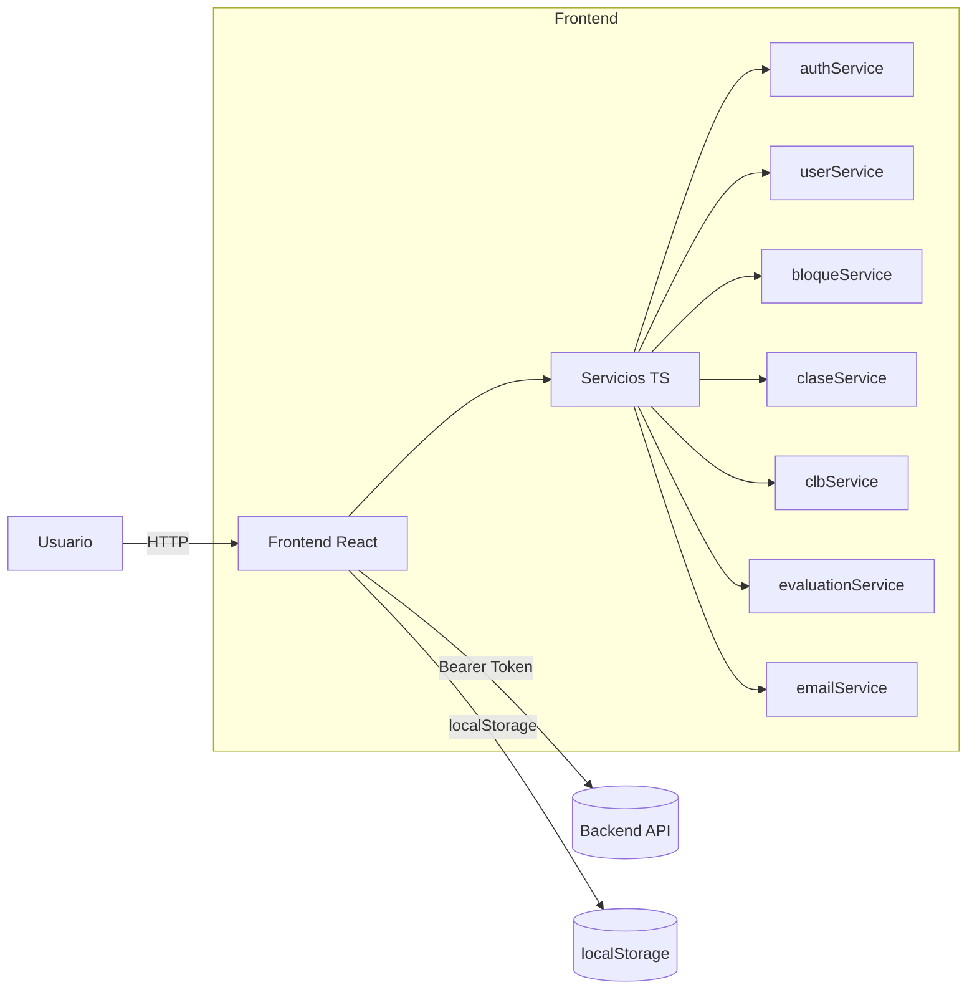
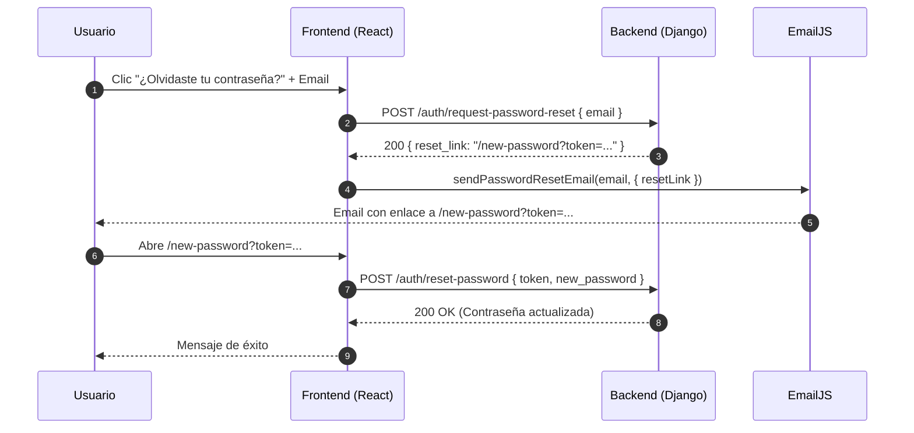

# Manual Técnico – La Lengua

## 1. Visión General de la Arquitectura

- **Frontend**: React + TypeScript (Vite), componentes en `frontend/src/Componentes/`.
- **Backend**: API REST en `http://localhost:8000/api` (framework no detallado aquí, se asume Django/DRF por rutas y requirements).
- **Persistencia en cliente**: `localStorage` para catálogo de bloques y asignaciones de estudiantes a bloques.
- **Servicios front**: capa de servicios en `frontend/src/services/` (auth, usuarios, bloques, clases, clubs, evaluaciones, email).
- **Comunicación**: `fetch` con JSON y bearer token.



## 2. Estructura de Directorios (Frontend)

- **`frontend/src/Componentes/`**: UI (Dashboards y vistas por rol)
  - `DashboardAdmin/FormularioUsuarios.tsx`
  - `DashboardUsu/Dashboard_Usuario.tsx`
  - `DashboardProfesor/ProgramarClase.tsx` (si aplica)
- **`frontend/src/services/`**: capa de servicios
  - `authService.ts`, `userService.ts`, `bloqueService.ts`, `clbService.ts`, `claseService.ts`, `emailService.ts`, etc.
- **`frontend/src/utils/`**
  - `createBloques.js`: seeding de bloques (A1–C2 x 3 turnos)
- **`frontend/src/main.tsx`**: bootstrap del frontend y fusión de `bloques_data`.
- **`docs/`**: documentación (`manual_usuario.md`, `manual_tecnico.md`).

## 3. Stack y Dependencias

- **Frontend**
  - React 18, TypeScript, Vite (supuesto por estructura de `main.tsx`).
  - `@emailjs/browser` para EmailJS.
  - Íconos: `react-icons/fa`.
- **Backend**
  - URL base: `http://localhost:8000/api` (ver `authService.ts`, `userService.ts`).
  - Endpoints típicos: `/auth/login/`, `/auth/profile/`, `/auth/register/`, `/users/`, `/users/{id}/toggle-active/`.

## 4. Servicios Frontend Clave

### 4.1 `authService.ts`
- Maneja login/logout y perfil.
- Guarda tokens en `localStorage` como `authToken` y `token` (compatibilidad).
- `getUserProfile()` obtiene el usuario actual (estructura `{ success, user }` o `{...user}` según backend). Se usa en el Dashboard para sincronizar bloque del backend al `localStorage`.

### 4.2 `userService.ts`
- `register(data)`: invoca `POST /auth/register/`.
  - Normaliza email según rol: student → `@thelanguage.co`, profesor → `@soy.thelanguage.co`.
- `getAll()`: `GET /users/` con `Authorization: Bearer <token>`.
- `toggleActive(userId)`: `POST /users/{id}/toggle-active/`.

### 4.3 `bloqueService.ts`
- Almacena catálogo y asignaciones en `localStorage`.
- Claves:
  - `bloques_data`: array de bloques `{ id, nivel, turno, profesores[], clases[], misiones[], horarios[] }`.
  - `user_blocks_assignment`: diccionario `{ [userId: string]: bloqueId }`.
- Funciones:
  - `getBloques()`, `getBloqueById(id)`.
  - `assignBloqueToUser(userId, bloqueId)`.
  - `getUserAssignedBloque(userId)`, `getUserBloqueInfo(userId)` (retorna bloque, clases, misiones, profesores, horarios).

### 4.4 `emailService.ts`
- EmailJS config:
  - `recipientEmail`: `the.languagess@gmail.com`
  - `serviceId`: `service_yypcyqc`
  - `templateId`: `template_kqcqa2b`
  - `publicKey`: `5IX1jA4A1wE1BoI8J`
- `sendContactEmail(formData)` valida y envía.

## 5. Flujos Técnicos Relevantes

### 5.1 Seeding y Fusión de Bloques
- Archivo: `frontend/src/utils/createBloques.js`
  - Genera 18 bloques (A1–C2 por Mañana/Tarde/Noche) y guarda en `localStorage.bloques_data`.
- Archivo: `frontend/src/main.tsx`
  - En el arranque:
    - Si no existe `bloques_data`, lo crea.
    - Si existe con longitud < 18, fusiona existentes + defaults, priorizando por `id`.

### 5.2 Sincronización de Asignación de Bloque
- En Admin (`FormularioUsuarios.tsx`):
  - Tras crear/editar un Estudiante y asignar `bloque_asignado`:
    - Se refresca la lista desde backend.
    - Se sincroniza `localStorage.user_blocks_assignment[userId] = bloqueId`.
- En Estudiante (`Dashboard_Usuario.tsx`):
  - Al cargar, tras `getUserProfile()`:
    - Si el perfil trae `bloque_asignado`, se llama `bloqueService.assignBloqueToUser(userId, backendBloque)` para rehidratar local.
  - Luego `getUserBloqueInfo(userId)` alimenta “Misiones Actuales” y “Clases”.

### 5.3 Clases Programadas (Híbrido)
- Se combinan dos fuentes:
  - Clases base del bloque (desde `bloqueService`).
  - Clases reales desde backend (`ClaseService.getClases()`), filtrando por `estudiantes` que contengan el `userId`.

### 5.4 Recuperación de contraseña (End-to-End)

- **Resumen**
  - Generación de token en backend (`PasswordResetTokenGenerator`).
  - Envío de correo vía EmailJS con enlace directo a `/new-password?token=...`.
  - Confirmación en backend con `{ token, new_password }`.

- **Endpoints**
  - `POST /auth/request-password-reset/`
    - Request: `{ "email": "usuario@dominio.com" }`
    - Response 200 (no enumera usuarios):
      ```json
      {
        "success": true,
        "message": "Se han enviado instrucciones a tu correo.",
        "token": "<uid>.<token>",
        "reset_link": "/new-password?token=<uid>.<token>"
      }
      ```
  - `POST /auth/reset-password/`
    - Request: `{ "token": "<uid>.<token>", "new_password": "********" }`
    - Response 200:
      ```json
      { "success": true, "message": "Contraseña actualizada correctamente." }
      ```

- **Frontend**
  - `LoginModal.tsx` → `handleSendReset()`
    1) Llama `authService.requestPasswordReset(email)` → obtiene `reset_link`.
    2) Llama `sendPasswordResetEmail(email, { resetLink })` para enviar el enlace con token.
  - `NewPassword.tsx` lee `token` desde `?token=...` y llama `authService.resetPassword(token, new_password)`.

- **Diagrama de secuencia**


- **Seguridad**
  - El token `PasswordResetTokenGenerator` es de un solo uso y con expiración implícita por timestamp/sal de usuario.
  - Respuestas de `request-password-reset` no deben enumerar usuarios (mensaje genérico); se expone `reset_link` en desarrollo para facilitar pruebas.
  - Requiere HTTPS en producción y protección CSRF no aplica al ser endpoints públicos con POST JSON.

## 6. Configuración y Entornos

- **Variables de entorno (sugerido)**
  - `VITE_API_BASE_URL` para URL del backend.
  - `VITE_EMAILJS_SERVICE_ID`, `VITE_EMAILJS_TEMPLATE_ID`, `VITE_EMAILJS_PUBLIC_KEY`.
- **Desarrollo**
  - Frontend: `npm install` y `npm run dev` (puerto por defecto 5173).
  - Backend: `pip install -r backend/requirements.txt` y ejecutar servidor en `:8000`.

## 7. Construcción y Despliegue

- **Build Frontend**
  - `npm run build` → genera artefactos en `dist/`.
- **Despliegue**
  - Servir `dist/` en un hosting estático (Netlify/Vercel) y apuntar a la API pública.
  - Ajustar CORS y `API_BASE_URL` para entorno productivo.

## 8. Seguridad

- **Autenticación**
  - Bearer token en encabezado `Authorization`.
  - Tokens persistidos en `localStorage` (recomendación: evaluar almacenamiento más seguro para producción 
    y/o rotación/expiración corta).
- **EmailJS**
  - Claves públicas están en el repo para dev; externalizar a variables de entorno en producción.
- **Datos**
  - No almacenar información sensible innecesaria en `localStorage`.

## 9. Manejo de Errores y Logging

- **Frontend**
  - `try/catch` alrededor de llamadas a `fetch`.
  - Mensajes amigables en UI (por ejemplo, al enviar Email o cargar clases).
  - Consola con logs de depuración (e.g. `DEBUG BLOQUE INFO`).
- **Backend**
  - Respuestas JSON con `success`, `message`, y `errors` cuando aplique.

## 10. Pruebas (Sugeridas)

- **Unitarias Front**
  - Testear `bloqueService` (get/set en `localStorage`).
  - Testear `userService.register` con mapeo de email por rol.
- **Integración**
  - Flujo Admin → asignar bloque → Dashboard Estudiante muestra Misiones/Clases.
- **E2E**
  - Iniciar sesión, ver dashboard, completar reto diario, abrir clase.

## 11. Estándares de Código

- **TypeScript** en componentes y servicios.
- **Imports** siempre al inicio del archivo.
- **Funciones puras** en servicios; componentes con `useEffect`/`useState` claros.
- **Convenciones**
  - Mapear campos del backend a nombres amigables del frontend en servicios (ver `userService.getAll`).

## 12. Versionamiento y Documentación

- **Documentación**
  - Manual de Usuario: `docs/manual_usuario.md`.
  - Manual Técnico (este documento): `docs/manual_tecnico.md`.
- **Versionamiento**
  - Mantener cambios significativos del modelo de datos y endpoints en este manual.

## 13. Anexos

### 13.1 Endpoints relevantes
- `POST /auth/login/`
- `GET /auth/profile/`
- `POST /auth/register/`
- `GET /users/`
- `POST /users/{id}/toggle-active/`
- Clases/Clubs/Evaluaciones: según módulos del backend.

### 13.2 Claves de localStorage
- `authToken`, `token`, `user` → autenticación.
- `bloques_data` → catálogo de bloques.
- `user_blocks_assignment` → asignaciones `{ [userId]: bloqueId }`.
- `challengeProgress_{userId}` / `streakLevel_{userId}` / `lastCompletedDate_{userId}` → Reto diario.

### 13.3 Plantillas de error front (sugerencia)
- `Error de conexión` (genérico).
- `No estás autenticado`.
- `No hay material publicado aún`.
- `Aún no perteneces a ningún club`.
